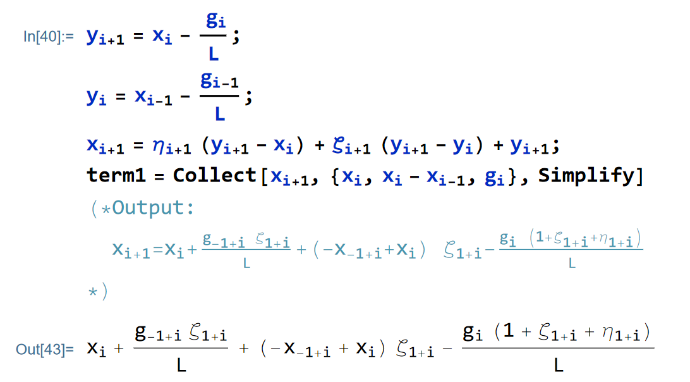
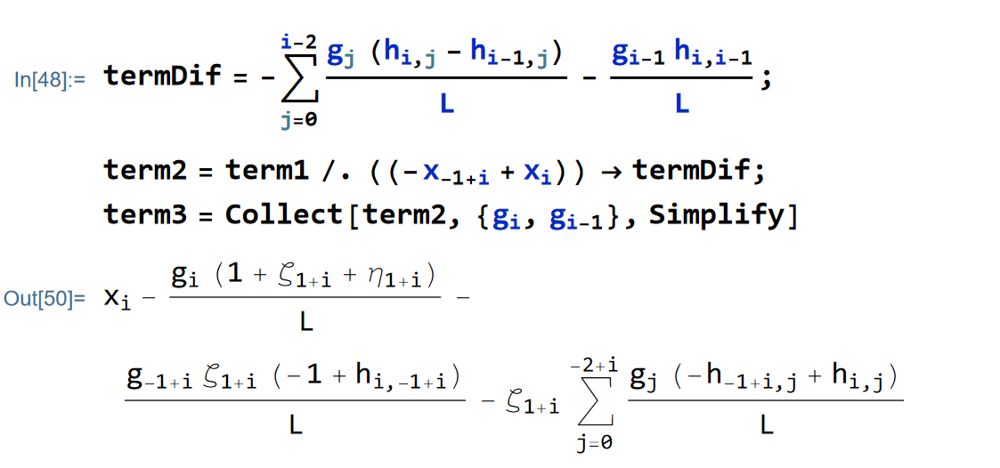

@def title = "Accelerated first-order methods as fixed-step first-order methods: conversion between momentum form and standard form"   
@def published = "August 06, 2021"   
@def tags =["programming", "Mathematica", "performance-estimation-problem"]  

# Accelerated first-order methods as fixed-step first-order methods: conversion between momentum form and standard form

**Shuvomoy Das Gupta**

*August 06, 2021*

In this blog, we discuss how to write accelerated first-order methods as fixed-step first-order methods.

#### Converting between momentum-form and and standard form of fixed-step first-order method

Consider a $L$-smooth function. ​Fixed step first order methods for this function $f$ are algorithms of the form (called the standard form)
$$x_{k}=x_{0}-\sum_{j=0}^{k-1}\frac{h_{k,j}}{L}\nabla f(x_{j}),\quad\textrm{(FSFOM)}$$​​​ 
where $k\in\{0,1,\ldots,N\}$​​​.

Also, we have the following "momentum form" of the fixed-step first-order method: 
$$
\begin{array}{ll}
y_{i+1} & =x_{i}-\frac{1}{L}\nabla f(x_{i})\\
x_{i+1} & =y_{i+1}+\zeta_{i+1}(y_{i+1}-y_{i})+\eta_{i+1}(y_{i+1}-x_{i}),
\end{array}\quad(\textrm{MomentumOGM)}
$$
which we show to be equivalent to (FSFOM). To show that (MomentumOGM) is in the form (FSFOM), we put, the iterative form $y_{+1}$​​ and $y_{i}$​​ in terms of the $x$​​ iterates in the second iterate. For simplification purpose, denote $g_{i}=\nabla f(x_{i})$​​​. We get:
$$
x_{i+1}=x_{i}+\zeta_{i+1}\left(x_{i}-x_{i-1}\right)-\frac{\left(\zeta_{i+1}+\eta_{i+1}+1\right)}{L}g_{i}+\frac{\zeta_{i+1}}{L}g_{i-1},\quad \textrm{(MOM-SIMP)}
$$
where the Mathematica code for this is shown below. 

```mathematica
Subscript[y, i + 1] = Subscript[x, i] -  Subscript[g, i]/L;
Subscript[y, i] = Subscript[x, i - 1] - Subscript[g, i - 1]/L;
Subscript[x, i + 1] = 
  Subscript[\[Eta], i + 1] (Subscript[y, i + 1] - Subscript[x, i]) + 
   Subscript[\[Zeta], i + 1] (Subscript[y, i + 1] - Subscript[y, i]) +
    Subscript[y, i + 1];
term1 = Collect[Subscript[x, 
 i + 1], {Subscript[x, i], Subscript[x, i] - Subscript[x, i - 1], 
  Subscript[g, i]}, Simplify]
  
(*Output:
    Subscript[x, i] + (
 Subscript[g, -1 + i] Subscript[\[Zeta], 
  1 + i])/L + (-Subscript[x, -1 + i] + Subscript[x, 
    i]) Subscript[\[Zeta], 1 + i] - (
 Subscript[g, 
  i] (1 + Subscript[\[Zeta], 1 + i] + Subscript[\[Eta], 1 + i]))/L
 *)
```



Now from (FSFOM):
$$\begin{aligned}
x_{i} & =x_{0}-\sum_{j=0}^{i-1}\frac{h_{i,j}}{L}g_{j},\\
x_{i-1} & =x_{0}-\sum_{j=0}^{i-2}\frac{h_{i-1,j}}{L}g_{j},\end{aligned}$$​​
which gives 
$$
\begin{aligned}
x_{i}-x_{i-1} & =-\sum_{j=0}^{i-2}\frac{(-h_{i-1,j}+h_{i,j})}{L}g_{j}-\frac{h_{i,i-1}}{L}g_{i-1}\quad \textrm{(Diff-x)} \end{aligned}
$$
and putting this in (MOM-SIMP) and then simplifying we get: 
$$
\begin{align*}
 & x_{i+1}\\
= & x_{i}-\zeta_{i+1}\sum_{j=0}^{i-2}\frac{\left(h_{i,j}-h_{i-1,j}\right)}{L}g_{j}-\frac{\zeta_{i+1}\left(h_{i,i-1}-1\right)}{L}g_{i-1}-\frac{\left(\zeta_{i+1}+\eta_{i+1}+1\right)}{L}g_{i},
\end{align*} \quad \textrm{(FSFOM-A)}
$$
where the Mathematica code for the simplification is shown below: 

```mathematica
termDif = -\!\(
\*UnderoverscriptBox[\(\[Sum]\), \(j = 0\), \(i - 2\)]
\*FractionBox[\(
\*SubscriptBox[\(g\), \(j\)]\ \((
\*SubscriptBox[\(h\), \(i, j\)] - 
\*SubscriptBox[\(h\), \(i - 1, j\)])\)\), \(L\)]\) - (
   Subscript[g, i - 1] Subscript[h, i, i - 1])/L;
term2 = term1 /. ((-Subscript[x, -1 + i] + Subscript[x, i])) -> 
    termDif;
term3 = Collect[term2, {Subscript[g, i], Subscript[g, i - 1]}, 
  Simplify]
```



Recall that, using (Diff-x) any (FSFOM) satisfying sequence will obey: 

$$x_{i+1}=x_{i}-\sum_{j=0}^{i-1}\frac{(h_{i+1,j}-h_{i,j})}{L}g_{j}-\frac{h_{i+1,i}}{L}g_{i}\quad \textrm{(Diff-x-2)}$$

Note that (Diff-x-2) and (FSFOM-A) are in the same format now for a pattern matching. Comparing the terms part by part, we get the following recursive system: 
​
$$
\begin{aligned}\forall_{j\in[0:i-2]}\quad h_{i+1,j} & -h_{i,j}=\zeta_{i+1}\left(h_{i,j}-h_{i-1,j}\right)\\
h_{i+1,i-1}-h_{i,i-1} & =\zeta_{i+1}\left(h_{i,i-1}-1\right)\\
h_{i+1,i} & =\zeta_{i+1}+\eta_{i+1}+1.
\end{aligned}
$$
with initial condition $h_{1,j}=0$​​​ for $j<0$​​​ and $h_{0,j}=0$​​​ for all $j$​​​. This system of equation gives us a way to compute $\zeta,\eta$​ from $h$​.

#### Specific example: OGM

As our example, we consider the Optimized Gradient Method (OGM) due to Kim and Fessler. For a $L$-smooth convex function $f$, $x_{0}\in\mathbf{R}^{d},\theta_{0}=1,$ the algorithm is defined in its *auxiliary form* as
$$\begin{array}{ll}
y_{i+1} & =x_{i}-\frac{1}{L}\nabla f(x_{i})\\
z_{i+1} & =z_{i}-\frac{2\theta_{i}}{L}\nabla f(x_{i})\\
x_{i+1} & =\left(1-\frac{1}{\theta_{i+1}}\right)y_{i+1}+\frac{1}{\theta_{i+1}}z_{i+1},
\end{array}\quad(\textrm{OGM)}$$​
where $i\in\{0,1,\ldots,N-1\}$​. 

First, note that in (OGM), gradient is evaluated at $x_{i}$​ iterates, so we will try to remove $z_{i}$​ iterates from (OGM), and write the last iterate as terms involving $y_{i+1},y_{i},$​ and $x_{i}$​. To that goal, we will write, $z_{i+1}$​ completely using $y_{i},x_{i},$​ and $y_{i+1}$​. From, the first iteration of (OGM), $$\frac{1}{L}\nabla f(x_{i})=x_{i}-y_{i+1},\quad(1)$$​ and putting (1) in the second iterate of (OGM), we have 

$$\begin{aligned}
z_{i+1} & =z_{i}-\frac{2\theta_{i}}{L}\nabla f(x_{i})\\
 & =z_{i}-(2\theta_{i})(x_{i}-y_{i+1})\\
 & =z_{i}-2\theta_{i}x_{i}+2\theta_{i}y_{i+1}\quad(2).\end{aligned}$$​ 
The third iterate of (OGM) for index $i$​ will give:

```julia
ClearAll["Global`*"];

Solve[y[i] (1 - 1/\[Theta][i]) + z[i]/\[Theta][i] == x[i], z[i]]
(*Out[] = {{z[i]\[Rule]y[i]+x[i] \[Theta][i]-y[i] \[Theta][i]}}*)
Collect[y[i] + x[i] \[Theta][i] - y[i] \[Theta][i], {x[i], y[i]}]
(*Out[] = y[i] (1-\[Theta][i])+x[i] \[Theta][i]*)
```

$$\begin{aligned}
x_{i} & =\left(1-\frac{1}{\theta_{i}}\right)y_{i}+\frac{1}{\theta_{i}}z_{i}\\
\Leftrightarrow z_{i} & =(1-\theta_{i})y_{i}+\theta_{i}x_{i},\end{aligned}$$​
and putting that in (2), we get:

```julia
z[i] - 2 \[Theta][i] x[i] + 2 \[Theta][i] y[i + 1] /. 
 z[i] -> y[i] (1 - \[Theta][i]) + x[i] \[Theta][i]
(*Out[] = y[i] (1-\[Theta][i])-x[i] \[Theta][i]+2 y[1+i] \[Theta][i]*)
```

$$\begin{aligned}
z_{i+1} & =z_{i}-2\theta_{i}x_{i}+2\theta_{i}y_{i+1}\\
 & =(1-\theta_{i})y_{i}-\theta_{i}x_{i}+2\theta_{i}y_{i+1}\quad(3),\end{aligned}$$​
and putting (3) into the third iterate of (OGM), we get

```julia
(*This code will collect terms with a specific patterns*)
(*Caution all the terms have to be scalrs, does not work with 
table term such x[i] etc, but works with xi and so on*)
CollectWRTVarList[expr_, vars_List] := 
  Expand[Simplify[
     expr /. Flatten[
       Solve[# == ToString@#, First@Variables@#] & /@ vars]], 
    Alternatives @@ ToString /@ vars] /. 
   Thread[ToString /@ vars -> vars];

term = (1 - 1/\[Theta][i + 1]) y[i + 1] + 
     1/\[Theta][i + 1] z[i + 1] /. 
    z[i + 1] -> 
     y[i] (1 - \[Theta][i]) - x[i] \[Theta][i] + 
      2 y[1 + i] \[Theta][i] // Simplify;
(*Out[] = (-y[i] (-1+\[Theta][i])-x[i] \[Theta][i]+y[1+i] (-1+2 \
\[Theta][i]+\[Theta][1+i]))/\[Theta][1+i]*)

CollectWRTVarList[
  term, {y[i + 1] - y[i], {y[i + 1] - x[i]}}] /. {-y[i] + y[1 + i] -> 
   t1, -x[i] + y[1 + i] -> t2 }
(*Out[] = {y[1+i]-t1/\[Theta][1+i]+(t1 \[Theta][i])/\[Theta][1+i]+(t2 \
\[Theta][i])/\[Theta][1+i]}*)

Collect[y[1 + i] - t1/\[Theta][1 + i] + (
   t1 \[Theta][i])/\[Theta][1 + i] + (
   t2 \[Theta][i])/\[Theta][1 + i], {t1, t2}, 
  Simplify] /. {t1 -> -y[i] + y[1 + i], t2 -> -x[i] + y[1 + i]}
(*Out[] = y[1+i]+((-y[i]+y[1+i]) \
(-1+\[Theta][i]))/\[Theta][1+i]+((-x[i]+y[1+i]) \
\[Theta][i])/\[Theta][1+i]*)
```

$$\begin{aligned}
x_{i+1} & =\left(1-\frac{1}{\theta_{i+1}}\right)y_{i+1}+\frac{1}{\theta_{i+1}}z_{i+1}\\
= & y_{i+1}+\frac{\theta_{i}-1}{\theta_{i+1}}(y_{i+1}-y_{i})+\frac{\theta_{i}}{\theta_{i+1}}(y_{i+1}-x_{i}).\end{aligned}$$
So, we have the following "*momentum form*" of (OGM):
$$\begin{array}{ll}
y_{i+1} & =x_{i}-\frac{1}{L}\nabla f(x_{i})\\
x_{i+1} & =y_{i+1}+\frac{\theta_{i}-1}{\theta_{i+1}}(y_{i+1}-y_{i})+\frac{\theta_{i}}{\theta_{i+1}}(y_{i+1}-x_{i}),
\end{array}\quad(\textrm{MomentumOGM)}$$​ 
which we show to be equivalent to (FSFOM).
To show that (MomentumOGM) is in the form (FSFOM), we put, the iterative form $y_{+1}$ and $y_{i}$ in terms of the $x$ iterates in the second iterate. For simplification purpose, denote $g_{i}=\nabla f(x_{i})$. We get:

```julia
Subscript[y, 1 + i] = Subscript[x, i] - Subscript[g, i]/L;

Subscript[y, i] = Subscript[x, i - 1] - Subscript[g, i - 1]/L;

Subscript[x, i + 1] = 
  Subscript[y, 
   i + 1] + ((Subscript[\[Theta], i] - 1) (Subscript[y, i + 1] - 
      Subscript[y, i]))/Subscript[\[Theta], i + 1] + (
   Subscript[\[Theta], i] (Subscript[y, i + 1] - Subscript[x, i]))/
   Subscript[\[Theta], i + 1];
   
Collect[Subscript[x, 
 i + 1], {Subscript[x, i], Subscript[x, i] - Subscript[x, i - 1], 
  Subscript[g, i]}, Simplify]
(*Output[] = Subscript[x, i]+(Subscript[g, -1+i] (-1+Subscript[\ \[Theta], i]))/(L Subscript[\[Theta], 1+i])+((-Subscript[x, \ -1+i]+Subscript[x, i]) (-1+Subscript[\[Theta], \ i]))/Subscript[\[Theta], 1+i]-(Subscript[g, i] (-1+2 Subscript[\ \[Theta], i]+Subscript[\[Theta], 1+i]))/(L Subscript[\[Theta], 1+i])*)
```

$$x_{i+1}=x_{i}+\frac{\left(\theta_{i}-1\right)\left(x_{i}-x_{i-1}\right)}{\theta_{i+1}}+\frac{g_{i-1}\left(\theta_{i}-1\right)}{L\theta_{i+1}}-\frac{g_{i}\left(2\theta_{i}+\theta_{i+1}-1\right)}{L\theta_{i+1}}\quad(1)$$

Now from (FSFOM):
$$\begin{aligned}
x_{i} & =x_{0}-\sum_{j=0}^{i-1}\frac{h_{i,j}}{L}g_{j},\\
x_{i-1} & =x_{0}-\sum_{j=0}^{i-2}\frac{h_{i-1,j}}{L}g_{j},\end{aligned}$$​
which gives 
$$\begin{aligned}
x_{i}-x_{i-1} & =-\sum_{j=0}^{i-2}\frac{(-h_{i-1,j}+h_{i,j})}{L}g_{j}-\frac{h_{i,i-1}}{L}g_{i-1}\quad(2)\end{aligned}$$​​ 
and putting this in (1) and then simplifying we get:

```julia
(*x[i+1]=*)
term1 = x[i] + (g[-1 + i] (-1 + \[Theta][i]))/(
   L \[Theta][
     1 + i]) + ((-x[-1 + i] + x[i]) (-1 + \[Theta][i]))/\[Theta][
    1 + i] - (g[i] (-1 + 2 \[Theta][i] + \[Theta][1 + i]))/(
   L \[Theta][1 + i]);
   
(*x[i]-x[i-1]=*)
termDif = (-h[i, i - 1]/L g[i - 1] - \!\(
\*UnderoverscriptBox[\(\[Sum]\), \(j = 0\), \(i - 2\)]\(
\*FractionBox[\((\(-h[i - 1, j]\) + h[i, j])\), \(L\)] g[j]\)\));

term2 = term1 /. (-x[-1 + i] + x[i]) -> termDif;

term3 = Collect[term2, {g[i], g[i - 1]}, Simplify];

term4 = term3 /. {h_[a_] -> Subscript[h, a], 
   h[i, j] -> Subscript[h, i, j], 
   h[-1 + i, j] -> Subscript[h, i - 1, j], 
   h[i, -1 + i] -> Subscript[h, i, i - 1]}
(*term4=Subscript[x, i]-(Subscript[g, i] (-1+2 Subscript[\[Theta], \
i]+Subscript[\[Theta], 1+i]))/(L Subscript[\[Theta], \
1+i])-(Subscript[g, -1+i] (-1+Subscript[\[Theta], i]) \
(-1+Subscript[h, i,-1+i]))/(L Subscript[\[Theta], \
1+i])-((-1+Subscript[\[Theta], i]) \!\(
\*UnderoverscriptBox[\(\[Sum]\), \(j = 0\), \(\(-2\) + i\)]
\*FractionBox[\(
\*SubscriptBox[\(g\), \(j\)]\ \((\(-
\*SubscriptBox[\(h\), \(\(-1\) + i, j\)]\) + 
\*SubscriptBox[\(h\), \(i, 
     j\)])\)\), \(L\)]\))/Subscript[\[Theta], 1+i]*)
```

$$\begin{aligned}
x_{i+1} & =x_{i}-\frac{\left(\theta_{i}-1\right)}{\theta_{i+1}}\sum_{j=0}^{i-2}\frac{\left(h_{i,j}-h_{i-1,j}\right)}{L}g_{j}\\
 & -\frac{\left(\theta_{i}-1\right)\left(h_{i,i-1}-1\right)}{L\theta_{i+1}}g_{i-1}-\frac{\left(2\theta_{i}+\theta_{i+1}-1\right)}{L\theta_{i+1}}g_{i}.\quad(\textrm{FSFOM-OGM})\end{aligned}$$​
Recall that, using (2) any (FSFOM) satisfying sequence will obey: 
$$x_{i+1}=x_{i}-\sum_{j=0}^{i-1}\frac{(h_{i+1,j}-h_{i,j})}{L}g_{j}-\frac{h_{i+1,i}}{L}g_{i}\quad(3)$$​
Note that (3) and (FSFOM-OGM) are in the same format now for a pattern matching. Comparing the terms part by part, we get the following recursive system: 
$$\begin{aligned}
\forall_{j\in[0:i-2]}\quad h_{i+1,j} & -h_{i,j}=\frac{\left(\theta_{i}-1\right)}{\theta_{i+1}}\left(h_{i,j}-h_{i-1,j}\right)\\
h_{i+1,i-1}-h_{i,i-1} & =\frac{\left(\theta_{i}-1\right)\left(h_{i,i-1}-1\right)}{\theta_{i+1}}\\
h_{i+1,i} & =\frac{\left(2\theta_{i}+\theta_{i+1}-1\right)}{\theta_{i+1}},\end{aligned}$$​
with initial condition $h_{1,0}=1,h_{1,j}=0$​ for $j<0$​ and $h_{0,j}=0$​ for all $j$​.
