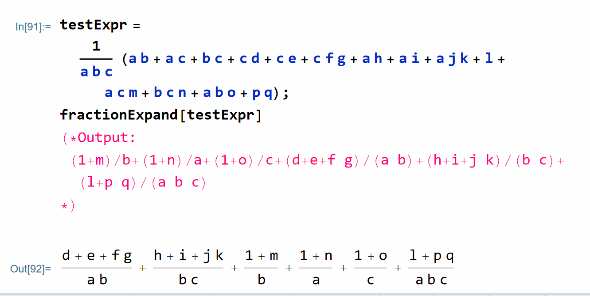

@def title = "Tips and tricks in Mathematica"
@def published ="August 26, 2021"
@def tags =["programming", "Mathematica"]

# Tips and tricks in Mathematica

**Shuvomoy Das Gupta**

*August 26, 2021*

In this blog, I am collecting a bunch of tips and tricks in Mathematica, that I find very useful for my work.

---

\toc 

---

## Clear all data

```mathematica
(*Important simplification codes*)
ClearAll["Global`*"];
```

## Removing outliers from data

This solution is due to [Carl Lange](https://mathematica.stackexchange.com/users/57593/carl-lange).

```mathematica
(*This dataset contains some outliers*)
Data={{0.105, 0.989213}, {0.106414, 0.988926}, {0.107828, 
  0.988636}, {0.109242, 0.988343}, {0.110657, 0.988049}, {0.112071, 
  0.987748}, {0.113485, 0.}, {0.114899, 1.}, {0.116313, 
  0.986826}, {0.117727, 0.986512}, {0.119141, 0.986196}, {0.120556, 
  0.995073}, {0.12197, 0.985551}, {0.123384, 0.0154883}, {0.124798, 
  0.984894}, {0.126212, 1.}, {0.127626, 0.984222}, {0.12904, 
  0.983887}, {0.130455, 0.983538}, {0.131869, 0.983197}, {0.133283, 
  0.}, {0.134697, 0.970927}, {0.136111, 0.98213}, {0.137525, 
  0.98177}, {0.138939, 1.}, {0.140354, 0.981041}, {0.141768, 
  0.980672}, {0.143182, 0.826229}, {0.144596, 0.979923}, {0.14601, 
  0.979546}, {0.147424, 0.979163}, {0.148838, 0.978778}, {0.150253, 
  0.978392}, {0.151667, 0.978}, {0.153081, 0.977605}, {0.154495, 
  0.977208}, {0.155909, 0.976807}, {0.157323, 0.976404}, {0.158737, 
  0.975999}, {0.160152, 0.55766}, {0.161566, 
  0.975177}, {0.16298, -0.000401533}, {0.164394, 0.974344}, {0.165808,
   1.00182}, {0.167222, 0.}, {0.168636, 0.973073}, {0.170051, 
  0.972646}, {0.171465, 0.972211}, {0.172879, 0.971787}, {0.174293, 
  0.971338}, {0.175707, 0.970898}, {0.177121, 0.970455}, {0.178535, 
  0.97001}, {0.179949, 0.96956}, {0.181364, -0.000767749}, {0.182778, 
  0.968655}, {0.184192, 0.968197}, {0.185606, 0.967738}, {0.18702, 
  0.967275}, {0.188434, 0.96681}, {0.189848, 0.966343}, {0.191263, 
  0.}, {0.192677, 0.965404}, {0.194091, 0.964925}, {0.195505, 
  0.964447}, {0.196919, 0.963967}, {0.198333, 0.963484}, {0.199747, 
  0.962999}, {0.201162, 1.}, {0.202576, 0.962022}, {0.20399, 
  0.961529}, {0.205404, 0.961034}, {0.206818, 0.960536}, {0.208232, 
  0.960036}, {0.209646, 0.959534}, {0.211061, 0.959029}, {0.212475, 
  0.958522}, {0.213889, 0.958013}, {0.215303, 1.}, {0.216717, 
  0.956987}, {0.218131, 0.956471}, {0.219545, 0.955953}, {0.22096, 
  0.955432}, {0.222374, 0.954909}, {0.223788, 0.954385}, {0.225202, 
  0.894605}, {0.226616, 0.953327}, {0.22803, 0.952796}, {0.229444, 
  0.952262}, {0.230859, 0.951726}, {0.232273, 0.951188}, {0.233687, 
  0.950648}, {0.235101, 0.950106}, {0.236515, 0.949561}, {0.237929, 
  0.949017}, {0.239343, 0.948467}, {0.240758, 0.947917}, {0.242172, 
  0.947364}, {0.243586, 0.946811}, {0.245, 0.946254}};
  
(*Remove outliers*)
CleanedData = DeleteAnomalies[
  LearnDistribution[MovingMedian[Data, 5], Method -> "Multinormal"], 
  Data]

(*Plot the cleaned data*)
ListPlot[CleanedData, PlotRange -> Full]

(*Compare with original data, red is original data, blue is cleaned data*)
ListPlot[{Data, CleanedData}, PlotStyle -> {Red, Blue}]
```


## Collecting terms with specific pattern 

```mathematica
(*This code will collect terms with a specific patterns*)
(*Caution all the terms have to be scalrs, does not work with 
table term such x[i] etc, but works with xi and so on*)

CollectWRTVarList[expr_, vars_List] := 
  Expand[Simplify[
     expr /. Flatten[
       Solve[# == ToString@#, First@Variables@#] & /@ vars]], 
    Alternatives @@ ToString /@ vars] /. 
   Thread[ToString /@ vars -> vars];
            
(*Example*)
            
CollectWRTVarList[
 a c x1 + a d x1 + a c x2 + a d x2 + a y1 + a y2, {x1 + x2, y1 + y2}]
            
(*output = a (c + d) (x1 + x2) + a (y1 + y2)*)            
```

## Expanding terms with fractions

```mathematica
(*The function that will expand expression involving fractional terms neatly*)

fractionExpand[expr_] :=
  Replace[Expand@expr, 
  expr2_Plus :> (Together@*Plus @@@ 
      GatherBy[List @@ expr2, Variables@*Denominator] // Total)]
```

```mathematica
(*Example*)
testExpr = 
  1/(a b c) (a b + a c + b c + c d + c e + c f g + a h + a i + a j k +
      l + a c m + b c n + a b o + p q);
fractionExpand[testExpr]
(*Output:
(1+m)/b+(1+n)/a+(1+o)/c+(d+e+f g)/(a b)+(h+i+j k)/(b c)+(l+p q)/(a b c)
*)
```




## Finding simple seqeunce function from the data

```mathematica
(*Example 1.*)
d[0] = d0;
d[i_] := 2 L + d[i - 1] /; i >= 1 

(*here/;i\[GreaterEqual]1 imposes the condition that i 
should be greater than 1 for the functional description to be true*);

dAnalytic[n_] := FindSequenceFunction[Table[d[i], {i, 1, 10}], n]

(*Example 2.*)
b[0] = b0;
b[i_] := 2 + (d[i - 1]/L) + b[i - 1] /; i >= 1
bAnalytic[n_] := FindSequenceFunction[Table[b[i], {i, 1, 10}], n]

(*CAUTION:the output is 0-based formula if in the seqeuence function 
we have {i,1,10},i.e.,in dAnalytic[n] and bAnalytic[n],n will range 
from {0,1,...},if we had started {i,0,10} the formulas would have n 
ranging from {1,2,...}*)
                
StringForm[" d[n] = `1` and b[n] = `2` for n \[Element] {0,1,2...}", dAnalytic[n], bAnalytic[n]]                
```

The output is:


## Simplifying recursion without closed form solution

```mathematica
(*----------------------------------------------*)
w[0] = w0;
w[k_] := w[k - 1] - 1/L Sum[h[k, i] g[i], {i, 0, k - 1}] /; k >= 1 

(* here /; i\[GreaterEqual] 1 imposes the condition that i \
should be greater than 1 for the functional description to be true *);

StringForm["Table of w[i]"]
Table[w[i], {i, 0, 3}] // TableForm

(*Observe the pattern in w[i]*)

StringForm["Observe the pattern in w[i]"]
{Expand[w[1]],
 Collect[Expand[w[2]], {g[0], g[1]}],
 Collect[Expand[w[3]], {g[0], g[1], g[2]}]}
 
(*Try to guess the pattern now*)
StringForm["Guess the pattern in w[i] via wSimp[i]"]
wSimp[0] = w0;
wSimp[k_] := wSimp[0] - 1/L Sum[Sum[h[l, i] g[i], {l, i + 1, k}], {i, 0, k - 1}] /; k >= 1

Table[w[i], {i, 1, 3}] // TableForm
Table[Simplify[wSimp[i]], {i, 1, 3}] // TableForm

StringForm["See if w[i]==wSimp[i]"]
Table[Simplify[wSimp[i] - w[i]], {i, 1, 3}] // TableForm
```


## Define functions that will take vectors

```mathematica
(*Define functions that will take vectors*)
fun2[a_, b_] := 
 Assuming[a \[Element] Vectors[n, Reals] && 
    b \[Element] Vectors[n, Reals], (c1 a + c2 b) . (c1 a + c2 b) // 
     TensorExpand // Simplify] /. p_ Dot[t_, t_] -> p Norm[t]^2
fun2[x, y]

(*Test*)
fun2[x, y] 

(*Output = c1^2 Norm[x]^2 + c2 (2 c1 x . y + c2 Norm[y]^2) *)
```

## Running `Julia` from `Mathematica`

```mathematica
(*Working with Julia*)
(*----------------*)

RegisterExternalEvaluator["Julia", 
  "C:\\Users\\shuvo\\AppData\\Local\\Programs\\Julia \
1.5.0\\bin\\julia.exe"];
FindExternalEvaluators["Julia"];
(*Start Julia from Mathematica*)
session = StartExternalSession["Julia"]

(*CD into the directory that contains the data*)
(*Export data from Julia*)
dataFromJulia = ExternalEvaluate[session, "using JLD2;
cd(\"c:\\\\Users\\\\shuvo\\\\Google Drive\\\\GitHub\\\\Learning_PEP\\\
\\2_Gradient_Descent_Potential_Computation_using_PEP\");
pwd()
"]

(*Load the data in Julia*)
ExternalEvaluate[session, 
  "@load \"POTENTIAL_PEP_OUTPUT.jld2\" p_star \[Lambda]_optimal  \
a_optimal b_optimal c_optimal d_optimal N_array;
"];

(*Load the data in Mathematica, so that the Julia variables get \
converted into Mathematica variables *)
pStar = ExternalEvaluate[session, "p_star"];
aOptimal = ExternalEvaluate[session, "a_optimal"];
bOptimal = ExternalEvaluate[session, "b_optimal"];
cOptimal = ExternalEvaluate[session, "c_optimal"];
dOptimal = ExternalEvaluate[session, "d_optimal"];
Narray = ExternalEvaluate[session, "N_array"];
```


## Running `Mathematica` from `Julia`

We can run Mathematica from Julia using `MathLink.jl`. We can install `MathLink.jl` in Julia using the following command

```julia 
ENV["JULIA_MATHKERNEL"]="C:\\Program Files\\Wolfram Research\\Mathematica\\12.3\\MathKernel.exe" # path to MathKernel.exe
ENV["JULIA_MATHLINK"]="C:\\Program Files\\Wolfram Research\\Mathematica\\12.3\\SystemFiles\\Links\\MathLink\\DeveloperKit\\Windows-x86-64\\SystemAdditions\\ml64i4.dll" # path to MathLink
import Pkg
Pkg.add("MathLink")
Pkg.build("MathLink")
```

Now suppose we want to run the following Mathematica command in Julia.

```mathematica
a = Table[{x, N[x Sin[x]]}, {x, 0, 4, .3}];
FindFormula[a, x]
```

We run this Julia by putting the expression above in weval() block as follows.

```julia 
weval(W`
    a = Table[{x, N[x Sin[x]]}, {x, 0, 4, .3}];
    FindFormula[a, x]
    `)

# output
# ------
# W"Times"(W"x", W"Sin"(W"x"))
# In Mathematica it will correspond to
# Times[x,Sin[x]] = x Sin[x]
```

## Finding convergence rate using the log-log plot

Consider the following data. 

```mathematica
Narray = Table[i, {i, 1, 50}];

perfMeasure = {0.12500000039401646, 0.06594597669442348, 
   0.04289324973901232, 0.03256516933794558, 0.02439360612424908, 
   0.019814662514600474, 0.01651332612698534, 0.01403712301081951, 
   0.01218149925018591, 0.010707803345049002, 0.009565888232158155, 
   0.008697583409315162, 0.007952102291835897, 0.007297301195680385, 
   0.006730482071052881, 0.006252646825576575, 0.005811266656901224, 
   0.005375016068984765, 0.004988492057531461, 0.004678377044818489, 
   0.004432075710848663, 0.004182361213651744, 0.003927793416225444, 
   0.003685188468346122, 0.0035042664229482465, 0.0033476311067778732,
    0.003197565715268286, 0.003042783220507925, 0.002897332765325484, 
   0.0027996149048139653, 0.0027113029867317606, 0.002611154164034634,
    0.0025004251428767336, 0.0023944918234701054, 
   0.0023289238102664417, 0.002269349268869964, 0.0022063087714561456,
    0.0021491496850726713, 0.0020823484078409675, 
   0.0020174824338334476, 0.0019410515750403516, 
   0.0018646784364243156, 0.0018059789720844554, 
   0.0017544334125811612, 0.001701395601716227, 0.0016528475942262394,
    0.0016101924826737329, 0.0015764160943991692, 
   0.0015510946954243204, 0.0015327205414233504};
   
data = MapThread[List, {Narray, perfMeasure}];

Show[ListPlot[data], 
 AxesLabel -> {"N", 
   "f (\!\(\*SubscriptBox[\(x\), \(N\)]\))-f( \
\!\(\*SubscriptBox[\(x\), \(*\)]\))"}, 
 PlotLabel -> 
  "f (\!\(\*SubscriptBox[\(x\), \(N\)]\))-f \
(\!\(\*SubscriptBox[\(x\), \(*\)]\)) vs N", 
 LabelStyle -> {GrayLevel[0]}]
```


Denote, $y \coloneqq f(x_N)-f(x_\star)$ and $x\coloneqq N$, and assume that the $y$ is of the form $a x^k$. Then we can compute the best possible values of $a,k$ using log-log mechanism. Taking 10 based logarithm on both sides of the equation $y=a x^k$, we get $\log y=k \log x + \log a$. Setting, $Y=\log y$, $X=\log x$, and $\log a = b$, we get: $Y=k X + b$. We will find the best values of $k,b$ using the function `NonlinearModelFit` . 

First, construct data in log-log scale. 

```mathematica
logNarray = Map[Log10, Narray] // N;
logPerfMeasure = Map[Log10, perfMeasure] // N;
loglogdata = MapThread[List, {logNarray, logPerfMeasure}]
```

which has the output:

```mathematica
(*
loglogdata = {{0., -0.90309}, {0.30103, -1.18081}, {0.477121, -1.36761}, {0.60206, \
-1.48725}, {0.69897, -1.61272}, {0.778151, -1.70301}, {0.845098, \
-1.78217}, {0.90309, -1.85272}, {0.954243, -1.9143}, {1., -1.9703}, \
{1.04139, -2.01927}, {1.07918, -2.0606}, {1.11394, -2.09952}, \
{1.14613, -2.13684}, {1.17609, -2.17195}, {1.20412, -2.20394}, \
{1.23045, -2.23573}, {1.25527, -2.26962}, {1.27875, -2.30203}, \
{1.30103, -2.3299}, {1.32222, -2.35339}, {1.34242, -2.37858}, \
{1.36173, -2.40585}, {1.38021, -2.43354}, {1.39794, -2.4554}, \
{1.41497, -2.47526}, {1.43136, -2.49518}, {1.44716, -2.51673}, \
{1.4624, -2.538}, {1.47712, -2.5529}, {1.49136, -2.56682}, {1.50515, \
-2.58317}, {1.51851, -2.60199}, {1.53148, -2.62079}, {1.54407, \
-2.63284}, {1.5563, -2.6441}, {1.5682, -2.65633}, {1.57978, \
-2.66773}, {1.59106, -2.68145}, {1.60206, -2.69519}, {1.61278, \
-2.71196}, {1.62325, -2.7294}, {1.63347, -2.74329}, {1.64345, \
-2.75586}, {1.65321, -2.76919}, {1.66276, -2.78177}, {1.6721, \
-2.79312}, {1.68124, -2.80233}, {1.6902, -2.80936}, {1.69897, \
-2.81454}}    
*)
```

Let us find the best fit.

```mathematica
nlm = NonlinearModelFit[loglogdata, k X + b, {k, b}, X]
(* Output: FittedModel[-0.806098 - 1.17805 X]*)
```

The best parameter values for $k,b$ are:

```mathematica
nlm["BestFitParameters"]
(* Output: {k -> -1.17805, b -> -0.806098}*)
```

Hence, we have $a=10^b=0.156279$. And, $f(x_N)-f(x_\star)=0.156279 \frac{1}{N^{1.17805}}$.

A plot of how good the fit is in the original scale can be observed by the following code. 

```julia 
Show[ListPlot[data], Plot[0.156279/x^1.17805, {x, 1, 50}], 
 Frame -> True]
```


## Copy Mathematics code as Unicode characters

This solution is from the [link](https://mathematica.stackexchange.com/questions/1137/how-to-copy-as-unicode-from-a-notebook). Suppose we want to copy the following text from Mathematica into some other editor while preserving the Unicode characters:

```mathematica
(*Code to copy from Mathematica preserving Unicdoe*)
u1 = -((b + β + a1)/((b + β) rμ));
u2 = -((μ a2)/((1 + b μ + β μ) rμ)); 
Reduce[
 Abs[1 + rμ u1] > Abs[rμ u2] && 
  b > 0 && β > 0 && μ > 0 && 0 < rμ <= 1 && 
  Abs[u1] >= 1 && a1 > 0, {a1, a2}, Reals]
```

We define the following function.

```mathematica
SetAttributes[copyUnicode, HoldFirst]

copyUnicode[expr_, form_: InputForm] := 
  Run["clip <", 
   Export["$Clipboard.temp", ToString[Unevaluated@expr, form], "Text", 
    CharacterEncoding -> "Unicode"]];
```

And then run the following from Mathematica.

```mathematica
(*Put the entire Mathematica code in the function copyUnicode, i.e., (code_to_copy)//copyUnicode or copyUnicode[code_to_copy]*)
(u1 = -((b + β + a1)/((b + β) rμ));
u2 = -((μ a2)/((1 + b μ + β μ) rμ)); 
Reduce[
 Abs[1 + rμ u1] > Abs[rμ u2] && 
  b > 0 && β > 0 && μ > 0 && 0 < rμ <= 1 && 
  Abs[u1] >= 1 && a1 > 0, {a1, a2}, Reals])//copyUnicode    
  
(*output:
Hold[u1 = -((b + β + a1)/((b + β)*rμ)); u2 = -((μ*a2)/((1 + b*μ + β*μ)*rμ)); 1*Reduce[Abs[1 + rμ*u1] > Abs[rμ*u2] && b > 0 && β > 0 && μ > 0 && Inequality[0, Less, rμ, LessEqual, 1] && Abs[u1] >= 1 && a1 > 0, {a1, a2}, Reals]]
*)  

```

## Parametric optimization problem

```julia 
Minimize[{(-a)*x + ((b + β)/2)*(x^2 + y^2), a > b + β && β > 0 && b > 0 && 0 <= x <= 1 && 0 <= y <= 1}, {x, y}]
```


## Completing squares for a multi-variate polynomials

```mathematica
(*Complete square*)
CompleteTheSquare::notquad = 
  "The expression is not quadratic in the variables `1`";
CompleteTheSquare[expr_] := CompleteTheSquare[expr, Variables[expr]]
CompleteTheSquare[expr_, Vars_Symbol] := 
 CompleteTheSquare[expr, {Vars}]
CompleteTheSquare[expr_, Vars : {__Symbol}] := 
  Module[{array, A, B, C, s, vars, sVars}, 
   vars = Intersection[Vars, Variables[expr]];
   Check[array = CoefficientArrays[expr, vars], Return[expr], 
    CoefficientArrays::poly];
   If[Length[array] != 3, Message[CompleteTheSquare::notquad, vars]; 
    Return[expr]];
   {C, B, A} = array; A = Symmetrize[A];
   s = Simplify[1/2 Inverse[A] . B, Trig -> False];
   sVars = Hold /@ (vars + s); A = Map[Hold, A, {2}];
   Expand[A . sVars . sVars] + 
     Simplify[C - s . A . s, Trig -> False] // ReleaseHold];

```

```mathematica
(*Example*)
CompleteTheSquare[a x^2 + b x + c y^2 + d y, {x, y}]
(*
-((a b^2 c^2 + a^2 c d^2)/(4 a^2 c^2)) + a (b/(2 a) + x)^2 + 
 c (d/(2 c) + y)^2    
    *)
```

## Matrix manipulation

```mathematica
(**Extracting column of a matrix**)
col[X_, i_] := Transpose[{X[[All, i]]}];
row[X_, i_] := {X[[i]]};
(*Example*)
mat = Table[Subscript[m, i, j], {i, 5}, {j, 5}];
col[mat, 1]
row[mat, 2]
```

```mathematica
(**Concatenating matrices**)

(*Concatenating matrices horizontally [A1 A2]*)
HCat[A1_, A2_] := ArrayFlatten[{{A1, A2}}];

(*Concatenating matrices vertically 
[A1
A2
]*)
VCat[A1_, A2_] := ArrayFlatten[{{A1}, {A2}}];

(*Concatenating horizontally and vertically [A11	A12
                                             A21	A22
]*)

PartCat[A11_, A12_, A21_, A22_] := 
  ArrayFlatten[{{A11, A12}, {A21, A22}}];
  
(*Examples*)
(**********)

(*HCat Example*)
n = 3; m = 2;
A1 = Table[Subscript[a1, i, j], {i, n}, {j, n}];
A2 = Table[Subscript[a2, i, j], {i, n}, {j, m}];
HCat[A1, A2]  

(*VCat Example*)
A1 = Table[Subscript[a1, i, j], {i, n}, {j, n}];
A2 = Table[Subscript[a2, i, j], {i, m}, {j, n}];
VCat[A1, A2]

(*PartCat Example*)
A11 = Table[Subscript[a11, i, j], {i, n}, {j, n}];
A12 = Table[Subscript[a12, i, j], {i, n}, {j, m}];
A21 = Table[Subscript[a21, i, j], {i, m}, {j, n}];
A22 = Table[Subscript[a22, i, j], {i, m}, {j, m}];
PartCat[A11, A12, A21, A22]
```

```mathematica
(*Define an unit column vector*)
eiVec[n_, i_] := Module[{t1}, t1 = ConstantArray[0, {n, 1}];
  t1[[i]] = {1}; t1]
eiVec[7, 3] // MatrixForm
```

## Verifying inequality in Mathematica

### A simple example: AM-GM inequality

We start with a very simple example: the well-known AM-GM inequality. It states that for $x>0,y>0$ we have 
$$
\frac{x+y}{2} \geq \sqrt{xy}.
$$
We can verify it as follows. 

```mathematica
(* Clear all the variables, this often comes handy*)
ClearAll["Global`*"];

(*construct the conditions*)
conditions = x > 0 && y > 0;

(*check wheather the AM-GM inequality holds for all x,y satisfying conditions*)

(*Create the AM GM inequality*)
inequalityAMGM = 
 ForAll[{x, y}, 
  conditions, (x + y)/2 >= 
   Sqrt[x y]] 
   
(*Verify if the inequality holds for all x,y satisfying conditions*)   
Resolve[inequalityAMGM] 
```

where we get the output `True`, so we have verified the AM-GM inequality.

### Cauchy inequality

The Cauchy inequality probably one of the most famous inequalities. Let us verify it in `Mathematica` for dimension 3.

```mathematica 
(* Clear all the variables *)
ClearAll["Global`*"];

(* Create the Cauchy inequality *)
ineqCauchy = ForAll[{x, y}, Element[x | y, Vectors[3, Reals]], 
       Abs[x . y] <= Norm[x]*Norm[y]]; 

(* Verify if the inequality holds *)
Resolve[ineqCauchy]
```

which outputs `True` again. We can run this for larger dimension too. However, keep in mind that larger the dimension, longer it would take for `Mathematica` to verify it. Hence, it is best if this verification process is kept confined to a smaller dimension, and then if the verification process yields `True`, then go for the good old pen and paper to prove it formally. 

### A more complicated example: Performance Estimation Problem

As our final example, we consider verifying an inequality that shows up in the performance estimation problem, for more details about this problem, please see the paper by Taylor et al. [here](https://arxiv.org/pdf/1502.05666.pdf). We want to verify an identity that shows up in Theorem 4 of the mentioned paper. Given vectors $f_i,f_i,x_i,x_j,g_i,g_j\in \mathbf{R}^n$ we want to show that the following two terms $t_1$ and $t_2$ are equal to each other. We have:
$$
t_1 = f_i - f_j - \left\langle g_j \mid x_i - x_j \right\rangle - \frac{1}{2(1/(\mu / L))} \left( \frac{1}{L}\|g_i - g_j \|_2^2 + \mu \|x_i - x_j \|_2^2-\left\langle g_j - g_i \mid x_j - x_i\right\rangle\right)
$$


and


$$
\begin{align*}
s_{i} & =\frac{\mu}{L-\mu}\left\langle g_{i}\mid x_{i}\right\rangle -\frac{\mu L}{2(L-\mu)}\|x_{i}\|_{2}^{2}-\frac{1}{2(L-\mu)}\|g_{i}\|_{2}^{2}\\
s_{j} & =\frac{\mu}{L-\mu}\left\langle g_{j}\mid x_{j}\right\rangle -\frac{\mu L}{2(L-\mu)}\|x_{j}\|_{2}^{2}-\frac{1}{2(L-\mu)}\|g_{j}\|_{2}^{2}\\
p_{ij} & =\left\langle g_{j}-\mu x_{j}\mid\left(\frac{L}{L-\mu}x_{i}-\frac{1}{L-\mu}g_{i}\right)-\left(\frac{L}{L-\mu}x_{j}-\frac{1}{L-\mu}g_{j}\right)\right\rangle \\
t_{2} & =s_{i}-s_{j}-p_{ij}.
\end{align*}
$$
Where $0<\mu < L$.

First we clear the variables.

```mathematica
(*Clear all the variables*)
ClearAll["Global`*"];
```

We are going to do this test for $n=3$. Let us create our assumptions.

```mathematica
n = 2; 
myAssumptions = Element[xi | xj | gi | gj, Vectors[n, Reals]] && Element[μ | L, Reals] && μ > 0 && L > 0 && μ < L
```

Let us construct $t_1$ first.

```mathematica
t1 = fi - fj - gj . (xi - xj) - (-((2*μ*(-gi + gj) . (-xi + xj))/L) + Norm[gi - gj]^2/L + μ*Norm[xi - xj]^2)/(2*(1 - μ/L))
```

Now, let us construct $t_2$ by constructing $s_i,s_j,$ and $p_{ij}$.

```mathematica
si = (μ/(L - μ))*gi . xi - ((μ*L)/(2*(L - μ)))*Norm[xi]^2 - (1/(2*(L - μ)))*Norm[gi]^2 + fi; 

sj = (μ/(L - μ))*gj . xj - ((μ*L)/(2*(L - μ)))*Norm[xj]^2 - (1/(2*(L - μ)))*Norm[gj]^2 + fj; 

pij = (gj - μ*xj) . (((L/(L - μ))*xi - (1/(L - μ))*gi) - ((L/(L - μ))*xj - (1/(L - μ))*gj)); 

t2 = si - sj - pij
```

Construct the identity now. 

```mathematica
identityPEP = ForAll[{gi, gj, xi, xj, μ, L}, myAssumptions, t1 == t2]
```

Time to resolve.

```julia 
Resolve[identityPEP]
```

This yields `True` (it will take a few minutes) so the identity in question is true for $n=3$. 

## Collect distributed sum and iversonian sum simplification

```mathematica
distributedSumRule1 = HoldPattern[a_. Sum[c_, y___]] :> Sum[a c, y];
distributedSumRule2 = 
  HoldPattern[Sum[a_. b_, y___] + Sum[c_. d_, y___]] :> 
   Sum[ a b + c d, y];
iversonRule1 = 
  HoldPattern[Sum[a_, List[j_, 1, n_], List[k_, j_, n_]]] :> 
   Sum[a, List[k, 1, n], List[j, 1, k]];
iversonRule2 = 
  HoldPattern[Sum[a_, List[k_, 1, n_], List[j_, 1, k_]]] :> 
   Sum[a, List[j, 1, n], List[k, j, n]];
```

Here are a couple of examples of sum simplification.

```mathematica
{c*Sum[a[j, k], {j, 1, n}, {k, 1, n}] + d*Sum[b[j, k], {j, 1, n}, {k, 1, n}] /. distributedSumRule1 /. distributedSumRule2, Sum[a[j, k], {j, 1, n}, {k, j, n}] /. iversonRule1, Sum[a[j, k], {k, 1, n}, {j, 1, k}] /. iversonRule2}
```


## Rule-based programming in Mathematica

Basic notation:

* `sym:obj` or `Pattern[sym, obj]` represents the pattern-object `obj`, assigned the name `sym`.
* The form `s_` is equivalent to `s:_`. Similarly, `s_h` is equivalent to `s:_h`, `s__` is equivalent to `s:__` and so on.

We have the following symbols for rule-based programming in Mathematica. 

1. `_ or Blank[]` is a pattern object that can stand for any Wolfram Language expression. 
2. `__` (two _ characters) or `BlankSequence[]` is a pattern object that can stand for any sequence of one or more Wolfram Language expressions. 
3. `___` (three _ characters) or `BlankNullSequence[]` is a pattern object that can stand for any sequence of zero or more Wolfram Language expressions. 
4. `patt/;test` is a pattern which matches only if the evaluation of test yields `True`.
5. `p1|p2` is a pattern object that represents any of the patterns `p1` or `p2`.
6. `p..` or `Repeated[p]` is a pattern object that represents a sequence of one or more expressions, each matching `p`. 

These patterns have the following full forms:

```mathematica
FullForm[x_] (*= Pattern[x,Blank[]]*)
FullForm[x__] (*= Pattern[x,BlankSequence[]]*)
FullForm[x___] (*= Pattern[x,BlankNullSequence[]]*)
FullForm[x:(_Integer|_Rational)] (*= Pattern[x, Alternatives[Blank[Integer], Blank[Rational]]]*)
FullForm[x:{(1|0)..}] (*= Pattern[x,List[Repeated[Alternatives[1,0]]]]*)
```

Let us take a look at some examples of rule-based programming.

**Sorting a list of integers**

Note that in this example, we are using `//.` which is the same as `ReplaceRepeated`. This repeatedly applies a rule or list of rules to an expression until it stops changing. 

```mathematica
(*Sorting a list of random integers*)

testlist = {20, 19, 17, 16, 12, 1, 14, 18, 8, 1, 1, 10, 20, 2, 14}
sortrule = {x___, y_, z_, t___} /; (y > z) :> {x, z, y, t};
testlist //. sortrule

(*Output:
{1, 1, 1, 2, 8, 10, 12, 14, 14, 16, 17, 18, 19, 20, 20}   
*)
```

**Delete duplicate elements from a list**

```mathematica
(*Delete duplicate elements from a list*)

testlist = {5, 2, 2, 1, 1, 4, 5, 3, 5, 4, 5, 1, 1, 4, 3}
delrule = {x___, y_, z___, y_, t___} :> {x, y, z, t};
testlist //. delrule

(*Output:
{5, 2, 1, 4, 3}    
*)
```

**Rule-based recursion function**

```mathematica
(*Rule based factorial*)
frules = {fact[1] -> 1, fact[n_Integer] :> fact[n - 1]*n}
(*To evaluate use ReplaceRepeated until we have a fixed point*)
fact[5] //. frules

(*Output:
120    
*)
```

**Take a list of numbers and raise the nonnegative integers to the cubic power**

```mathematica
testlist = {2, 2, -2, -1, -1, 0, -2, -2, 2, 0} 
(* Can be generated using 
    Table[Random[Integer, {-2, 2}], 10] *)

powrule = (x_Integer /; (x >= 0) :> x^3);

(*x_Integer: find the entries that have head integer,
/; on the condition that that entry is >= 0, raise the power of that entry to 3.
*)
testlist /. powrule

(* Output:
{-1, 8, -2, 8, 1, 0, -1, -1, 0, 8}
*)
```

**Take the square root of all the elements that are full squares**

```mathematica
(*Take the square root of all the elements that are full squares*)
testlist = Range[30] (*Will create
{1, 2, 3, 4, 5, 6, 7, 8, 9, 10, 11, 12, 13, 14, 15, 16, 17, 18, 19, \
20, 21, 22, 23, 24, 25, 26, 27, 28, 29, 30}
*)
sqrtrule = x_ /; (IntegerQ[Sqrt[x]]) :> Sqrt[x];
testlist /. sqrtrule

(*Output:
{1, 2, 3, 2, 5, 6, 7, 8, 3, 10, 11, 12, 13, 14, 15, 4, 17, 18, 19, \
20, 21, 22, 23, 24, 5, 26, 27, 28, 29, 30}
*)
```
**Take square root of numbers that are either integer or rational**

```mathematica
testlist={x,2,Pi,3/2,2/5,4,Sin[y],8,Cos[z]};
sqrtrule=x:(_Integer|_Rational):>Sqrt[x];
(* x:(_Integer|_Rational) is the shortcut for Pattern[x,Alternatives[Blank[Integer],Blank[Rational]]]*)
testlist/.sqrtrule

(*Output:
{x, Sqrt[2], \[Pi], Sqrt[3/2], Sqrt[2/5], 2, Sin[y], 2 Sqrt[2], 
 Cos[z]}
*)
```

**Optional pattern**

`patt :def` or `Optional[patt,def]` is a pattern object that represents an expression of the form `patt`, which, if omitted, should be replaced by the default value `def`.

```mathematica
f[{a}, {a, b}, {a, b, c}] /. {x__, Optional[y_, 1]} :> {x + y}  (* means that {x__,y_} is replaced with {x+y} whereas {x__} is replaced with {x+1} *)

(*Output:
f[{1 + a}, {a + b}, {a + b + c}]
*)
```

**Repeated pattern**

Repeated pattern is useful in cases when we have to match a sequence of expressions each of which is matched by a given pattern, but we don' t know how many terms there will be in a sequence. 

```mathematica
(*Convert to numbers all lists that represent binary digits, i.e., 
all lists that contain any number of ones and zeros mixed aribtrarily*)

mylist = {{1, 0, 0}, {0, 1, 0}, {1, 1, 1}, {2, 0, 1}, {1, 0}, {1, 0, 3}};
myrule = x : {(1 | 0) ..} :> FromDigits[x, 2];
mylist /. myrule

(*Output:
{4, 2, 7, {2, 0, 1}, 2, {1, 0, 3}}
*)
```
**Simple derivative function using rule-based programming**

```mathematica
(*Simple derivative function using rule based programming*)

diff[c_*f_, x_] /; FreeQ[c, x] := c*diff[f, x]
(*FreeQ[expr,var] returns true if expr does not depend on the variables var*)

diff[f_ + g_, x_] := diff[f, x] + diff[g, x]

diff[c_, x_] /; FreeQ[c, x] := 0

diff[x_^n_., x_] /; FreeQ[n, x] := n x^(n - 1)

(*x_^n_. means the pattern x_ and x_^n_, i.e., n_. can be omitted*)
```

Test the function. 

```mathematica
diff[3 x^2 - 2 x + 1, x]

(*Output:
-2 + 6 x
*)
```

